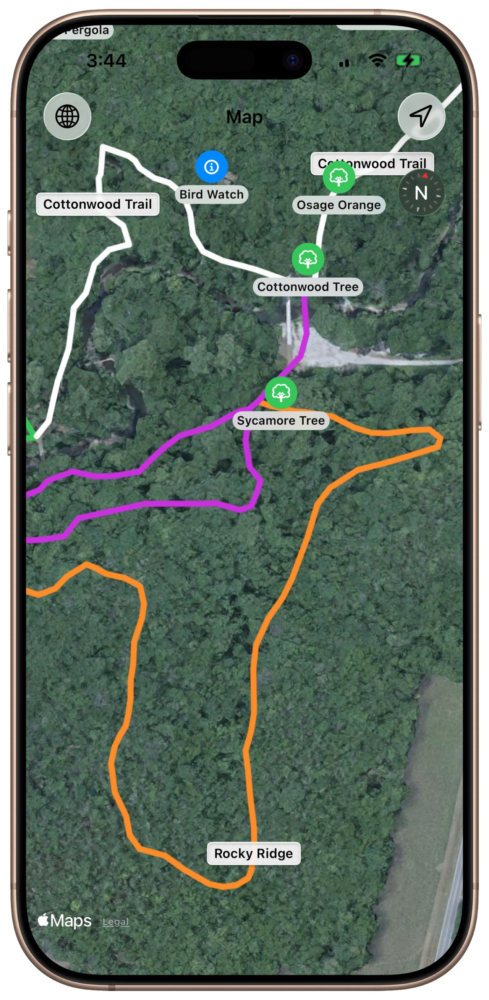

# Arts & Rec Guide - 1
## October 7, 2025

I volunteer on an advisory board for a local arboretum and botanical garden. (Such a beautiful place!) As a learning exercise, I’m building an app to display points of interest (POIs), the hiking trails, and the user’s location at the arboretum.

I will have descriptions about the art installations, trees, and various gardens accessible with just a tap of the icon.

