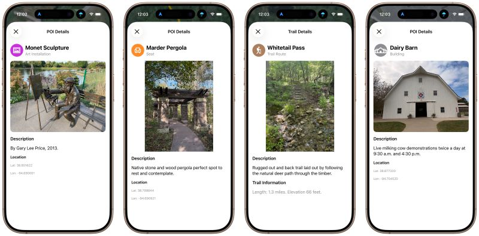

# External Test Flight Beta - Arts & Rec Guide
## October 13, 2025

My "Overland Park Arts & Rec Guide" iOS app is uploaded for external Test Flight review. Soon I'll be able to share a beta version more widely. 

I now have 19 trail routes and 214 points of interest logged from the Overland Park Arboretum, Deanna Rose Children's Farmstead, and art installations around town sponsored by the Friends of the Arts of Overland Park.

I have had a lot of fun hiking the trails and driving around Overland Park to log all these GPS locations and snap photos!

