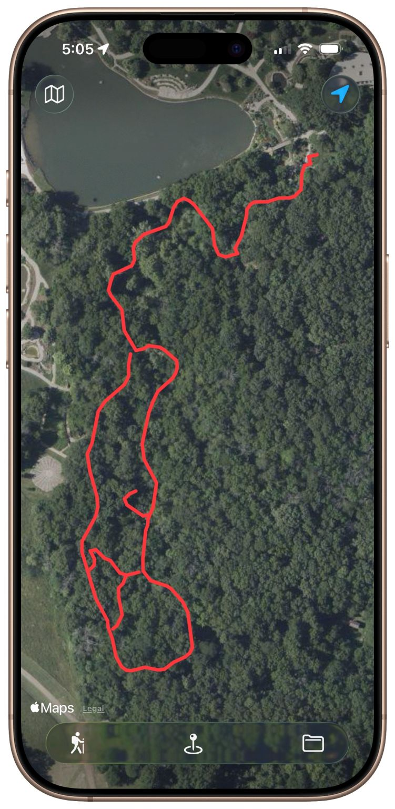

# Gretel Announcement
## October 14, 2025

While creating my Arts & Rec Guide app, I needed to walk and map about 20 trails and gather the GPS location of over 200 points of interest. I found the various hiking apps unsuited to these two tasks where I need to export the routes and the POIs for use in my app. 

So, for my second iOS app, I’m building a route tracking and POI plotting tool, called “Gretel” (in homage to the Grimm fairytale “Hansel & Gretel”).

My early version draws the user’s route and allows the dropping of pins with metadata. Pausing and resuming a route creates segments saved as separate arrays so you can create non-contiguous paths off the main route.

It exports the routes as individual geoJSON files and the POIs as a file of json objects. I might add a bunch more file formats if other people find the tool useful.

