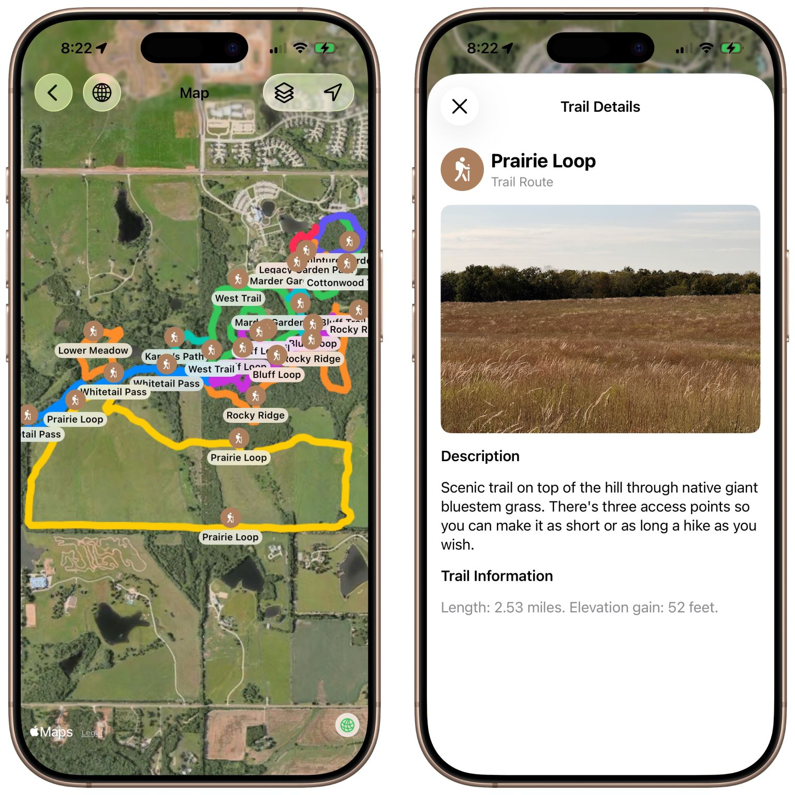

# Arts & Rec Guide — Close to V1.1 Launch
## November 4, 2025

I’m getting very close to completing the v1.1 update to my Arts & Rec Guide. I have been remapping the trails with my custom utility, Gretel, and taking a lot of photos of points of interest that I’d missed on the first couple of passes. Unfortunately autumn is not the best time to capture a botanical garden at its best. We’ve been so dry, too, that the natural water features are not flowing, so I’ll have to wait until late spring to take the remaining pictures.

However, native giant bluestem grass is stunning in the fall. The prairie is over seven feet tall and too dense to walk though. Photos don’t do it justice.

