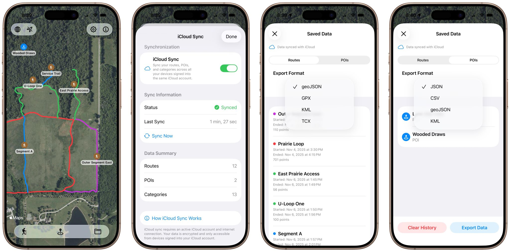

# Gretel — Feature Creep
## November 5, 2025

I’ve been experiencing a bit of self-inflicted feature creep on my trail and point-of-interest app, Gretel. It’s already a solid MVP for my own use, but I’ve started adding features that could make it valuable for parks and forestry teams who maintain trails and gardens.

The new additions focus on data export and iCloud sync—letting users save routes and points in common file formats and access them across devices. That means someone can map trails or log issues like downed trees, hazards, or invasive species on an iPhone, then review and manage the same data later on an iPad or Mac.

