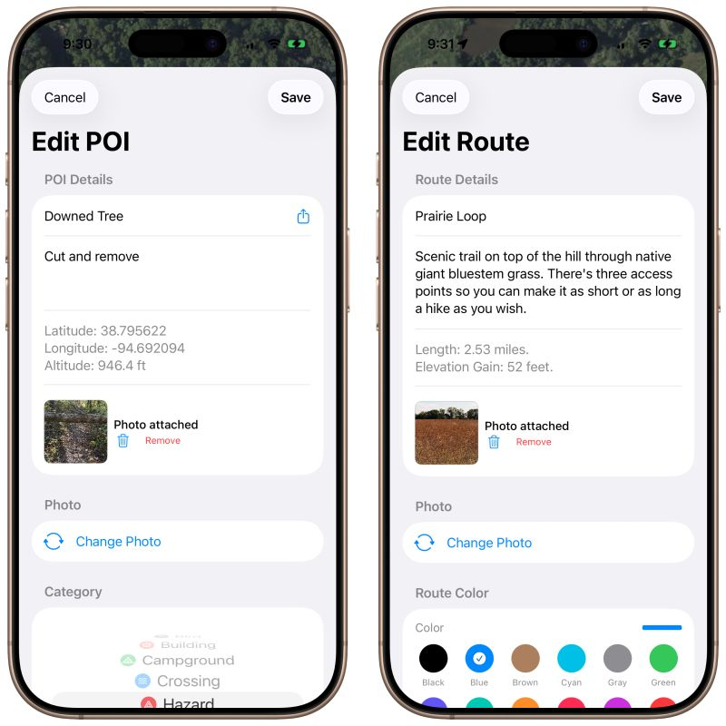

# Adding Photos to Trails and POIs
## November 20, 2025

I started on the ability to add photos to trail routes and dropped pins (POIs) this week. The user can snap a photo using the iPhone camera or attach a photo from the photo picker of previously saved photos.

They sync between instances of Gretel on other devices logged into the same iCloud account (Apple Account/ID), but I still need to add the ability to share the photo with POI details to other users through messaging or email. 

Would going further to make this more “enterprise capable” be worth the effort? For example, there’d be the primary “Supervisor” role who shares trails and dropped pins to secondary “Staff” roles through CloudKit.

