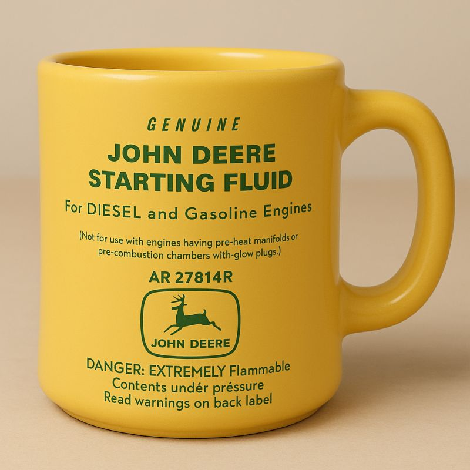

# John Deere Coffee Mug
## December 4, 2025

When I want to play around, I sometimes dig into old commercial art and see how close I can get with typefaces and the overall look with digital tools. For example, I recently re-created the label from a 1960s John Deere starter fluid can as an idea for a custom coffee cup. (Yes, I stole the coffee cup concept from International Harvester, but it IS a great idea.)

I know I'd violate about a dozen copyright laws if I produced one myself, so if anyone at John Deere is out there, here's my idea. 

I'd buy a dozen if they were made as heavy diner mugs.

