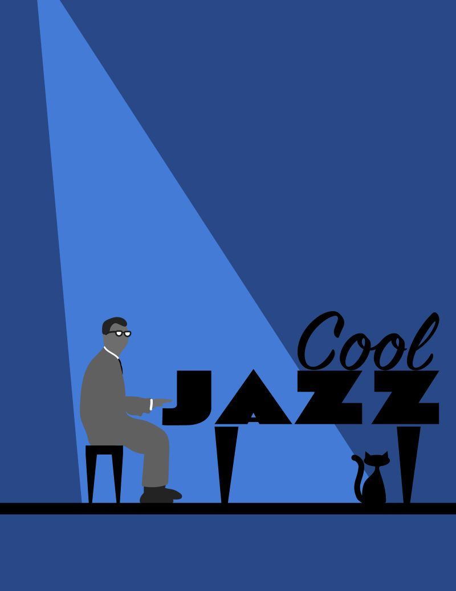

# Cool Jazz
## December 6, 2025

This design started solely because I was listening to Dave Brubeck while noodling around in Illustrator. I traced a photo of him sitting at the piano wearing his horn-rimmed glasses using the iPad and Apple Pencil. The piano started out as a simple rectangle until I started reviewing typefaces and the design started to come alive. A spotlight and cool jazz cat rounded it all out.

