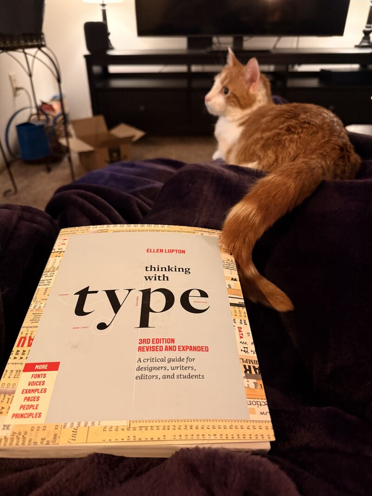

# Historical Use of the Long S
## December 28, 2025

I noticed an unusu al typographical character while watching Ken Burns’ “The American Revolution” called the “long s”, “medial s” or sometimes the “descending s”. It looks like a lower case “f” and if rendered correctly here would be this: ſ.

The long s (ſ), was standard typography in English printing from the 1400s through the late 1700s.

When to use the long s (ſ):
 • At the beginning of words: ſtart, ſay
 • In the middle of words: poſſible, uſe
 • At the start of syllables within words:
obſferve

When to use the regular short s:
 • At the end of words: was, his, Congress
 • Before the letter f: fatisfy (the second s is short)
 • In double s when it ends a word: possess (last s is short)

I’m very glad this odd little character faded from use despite it being common for 300 years.

