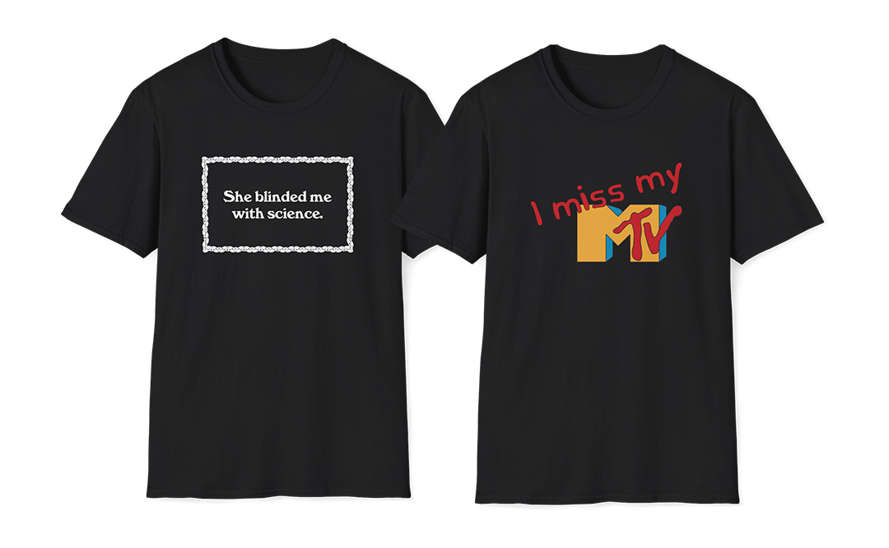

# I Miss MY MTV
## January 19, 2026

MTV was in a sense a Gen X gathering place and center of of our collective culture, no matter if you were a “120 Minutes” fan, a “Headbangers Ball” fan (hi!), a “Yo MTV Raps” fan—or secretly watched all three.

I know I can get it all on demand on YouTube, as I did yesterday so I could match the typeface used in Thomas Dolby’s video here—and it wasn’t really “MY” MTV for a very long time—I still miss it dearly.

