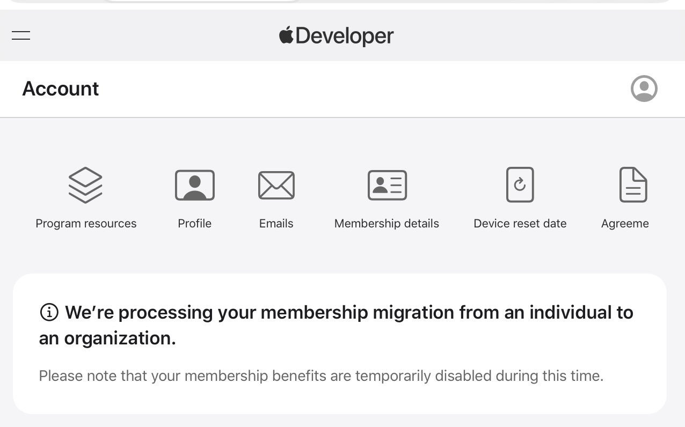

# Rome Wasn't Build in a Day
## January 22, 2026

“Rome wasn’t built in a day.” With government and corporate bureaucracies, that adage is never more true.

I started the process to switch my developer account from a single person to a business organization on January 6th—after I had formed my LLC, gotten an EIN, bank account, and registered with Dun & Bradstreet for a D-U-N-S Number because they use that to verify if the business is legit. 

It is interesting to me how tradition, convention, and a first mover advantage has given D&B, a private company, such power. The process is slow and subject to hiccups along that way that have required a three-way email chain between a developer support person, a D&B support person, and me.

Nearly three weeks later, I’m still in this holding pattern where I can’t submit my new app or push point updates to my other one until I get this finalized. 

What started as a simple business transition has become a masterclass in patience!

