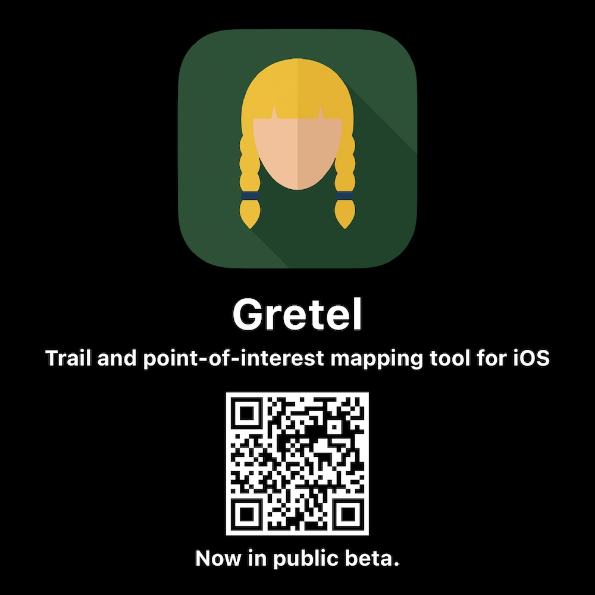

# Gretel TestFlight Beta
## February 6, 2026

I’ve reached a milestone in the development of my trail and point-of-interest mapping tool, Gretel. The first public beta is available in TestFlight! I always am holding my breath during the approval process.

What is Gretel?
A: Gretel is a GIS tool targeted for use to map trails and record and photograph things like hazards, water crossings, downed trees, invasive species, or just points-of-interest. Data is exportable and sharable to other staff.

Why Gretel?
A: Gretel, is from the Grimm Brothers fairy tale, “Hansel and Gretel”. Famously in that story they dropped breadcrumbs to find their way back home and escape the evil witch.

How is the data saved?
A: Gretel uses CloudKit so your trails are saved to your iCloud account. We do not have access to any data you’ve saved. It is as secure as you make your Apple account.

What export formats does Gretel support?
A: Trail routes export as geoJSON, GTX, KML, and TCX files. Point data exports as CSV, geoJSON, JSON, or KML for seamless integration with ArcGIS, QGIS, AutoCAD, and other professional mapping platforms.

