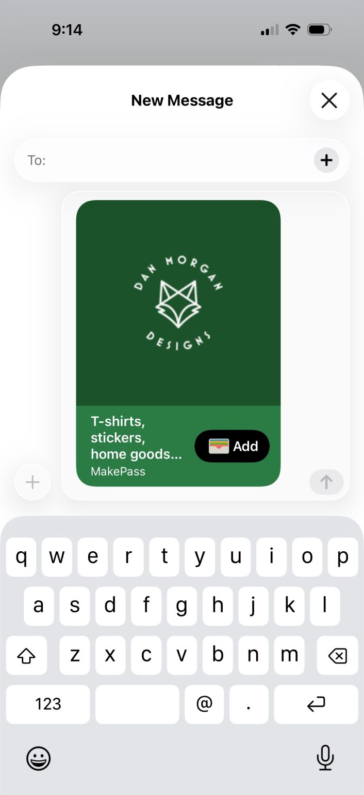

# Wallet Cards
## February 09, 2026

I had an idea to create an app that would enable the user to essentially create custom business cards that would be stored in the iPhone Wallet app. MakePass does this pretty darn well and probably keeps me from building one. It actually does a lot more than what I’d build, but doesn’t allow for tweaking of the font sizes and weights. 

I wish Apple would do more with this concept leveraging either Contacts or Wallet. Business cards are a disappearing art form and I’m still impressed by a well designed one.

