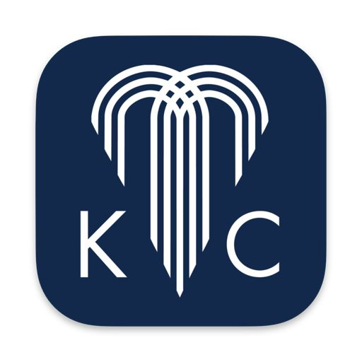

# On the Drawing Board
## February 16, 2026

My next iOS project is on the drawing board. The "Show Me KC Guide" will be targeted at visitors to the Kansas City metro area, specifically timed to be ready for the influx of visitors during the 2026 World Cup. (Can I say that without getting sued by FIFA?) 

It will leverage Apple's MapKit and the Google Places API (an odd mix, I know), but be hand-curated to weed out some of the cruft. Shooting for June 1.

