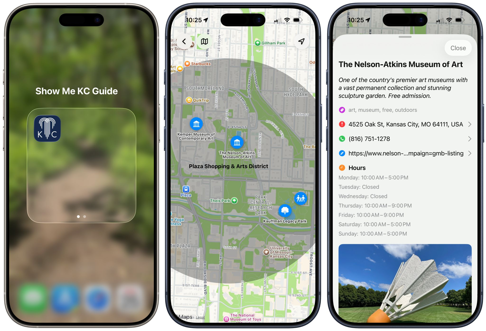

# Show Me KC Guide Update
## February 25, 2026

I have 13 “itinerary locales” identified in the Kansas City metro with an average of five spots per itinerary for people to check out. I’m hand-curating them to experience each location myself and take photos so international visitors will have a more personalized experience. 

The Kansas City metro, including Lawrence, are hosting four of the teams’ basecamps for the duration of the World Cup (England, Argentina, The Netherlands, and Algeria.)

In addition to those countries, teams and fans from Austria, Curaçao, Ecuador, and Tunisia will visit. That makes five languages outside of American and British English (Arabic, Dutch, French, German, and Spanish.)

I intend to have the app localized for those languages at launch.

