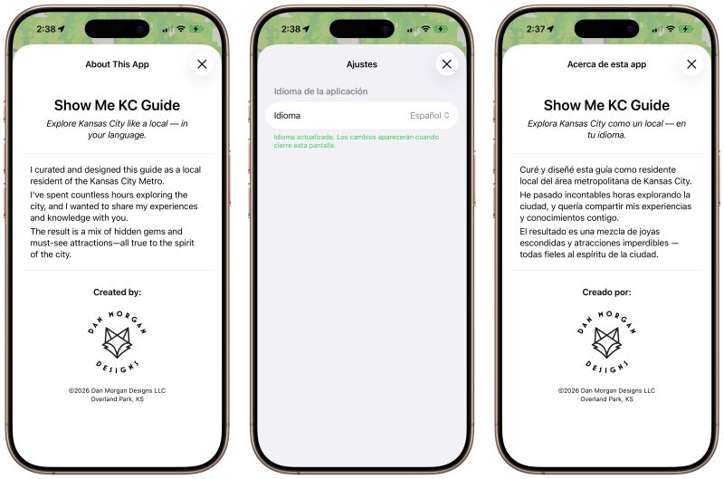

# Localization
## March 3, 2026

I have a renewed appreciation for localization efforts even with the assistance of LLMs. Accounting for all the strings in the UI and then the content on the screens is HARD.

I’m using the recommended localization Localizable.string files for the UI and About screen, but individual translated json files for the big blocks of text that I will wait until I think all the English narratives are “frozen” to translate.

