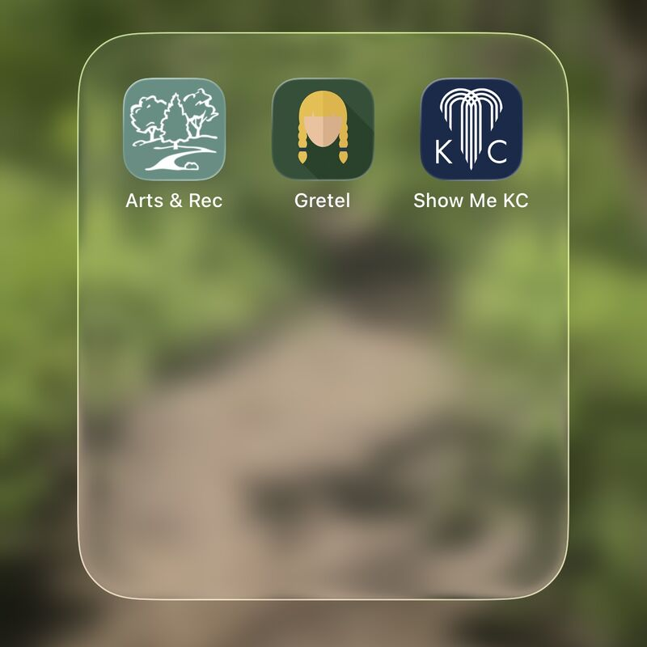

# Gretel TestFlight Beta
## March 15, 2026

Big day! I submitted all three of my apps for App Store review. The Arts & Rec guide is a just a point update with some additional POIs and a UI tweak. Gretel: "The trail route and POI mapping utility" is in its first review for commercial distribution. A milestone for something that started out as a tool for my use that I hope is useful for someone mapping trails and managing parks.

Finally, the "Show Me KC Guide" is in public Test Flight beta testing. The app is now translated into seven languages with 16 itineraries and over 85 places to visit in the KC Metro. This app is targeted at international visitors coming to Kansas City for the World Cup this summer, but will evolve into a general visitor's guide for anyone wanting a day trip in Kansas City. "Explore Kansas City like a local — in your language™." 

[Download the Test Flight beta](https://lnkd.in/gdMSKfny "Download the Test Flight beta").

