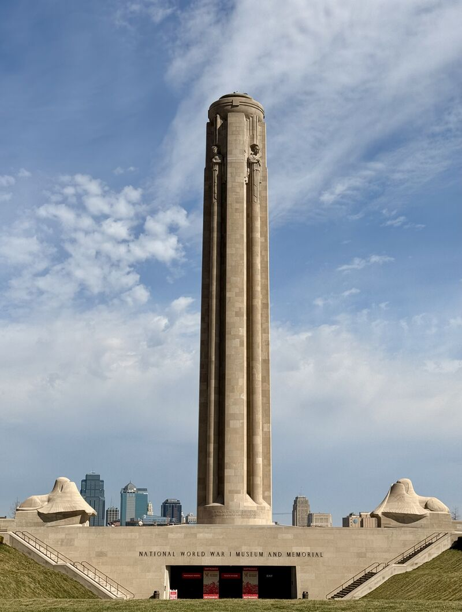

# Plaza & National WWI Museum & Memorial
## March 26, 2026

Back to revisiting the itineraries for my Show Me KC Guide — Day Trip Three: Plaza & National WWI Museum & Memorial. 

I had to pick up the pace today and visit more places in a day than I’d like. I walked The Plaza, the Kemper Musuem of Contemporary Art, and the WWI Museum. 

Allow for at LEAST two hours to do the WWI Museum and Memorial right. There’s a lot to take in and read. Stunning collection and displays!

