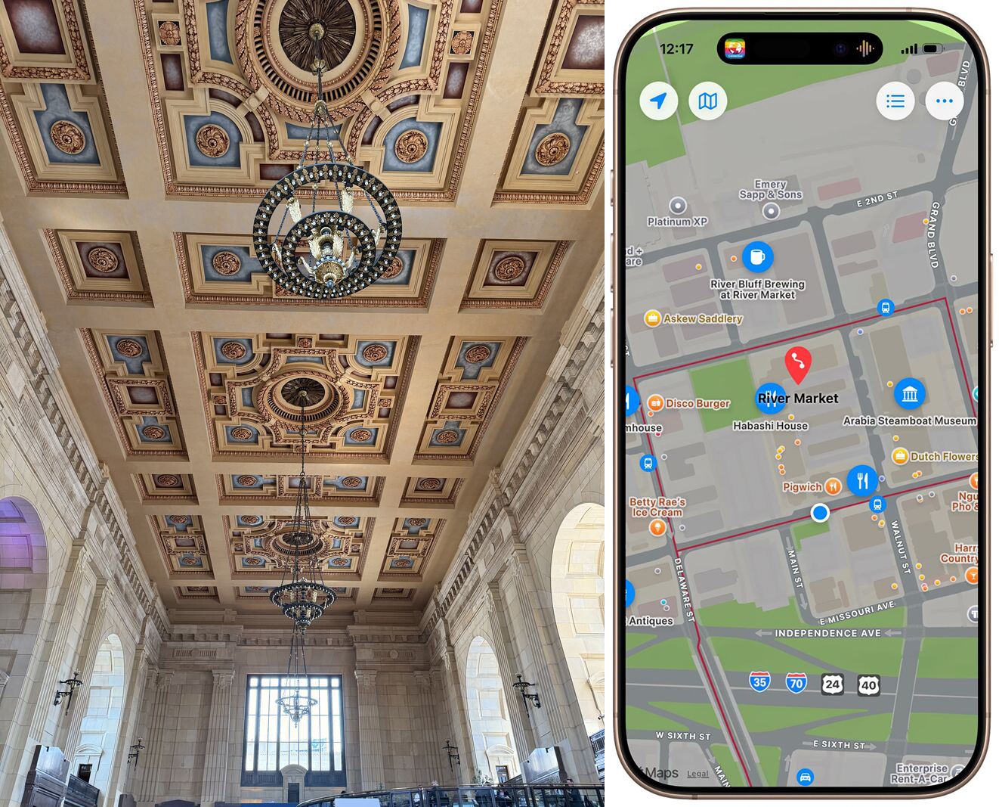

# Union Station & River Market
## March 27, 2026

Day Trip Four: Union Station & The River Market. When I was young, KC’s Union Station was an abandoned derelict site with a leaky roof. Today it is restored and host to restaurants and an interactive science destination for families, called “Science City” and “The Arvin Gottlieb Planetarium”.

I also rode the streetcar from there up to the River Market. I was able to follow along with my app showing where I was in relation to my itineraries and points-of interest.

