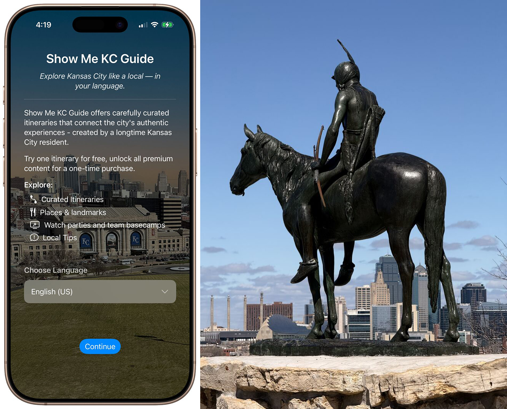

# Historic Indpendence, Missouri
## April 5, 2026

It has been a busy week+. I’m winding down my photography final note taking of my 16 itineraries.

The Truman Library did not disappoint. I’ve read a biography, his memoirs, and watched “Give ‘Em Hell Harry” at least 20 times, and I still learned a lot of new things. 

I built the onboarding screen this weekend already and snapped a photo of “The Scout” in Penn Valley Park near the WWI Museum & Memorial. Great views of the city from the Memorial and The Scout.

