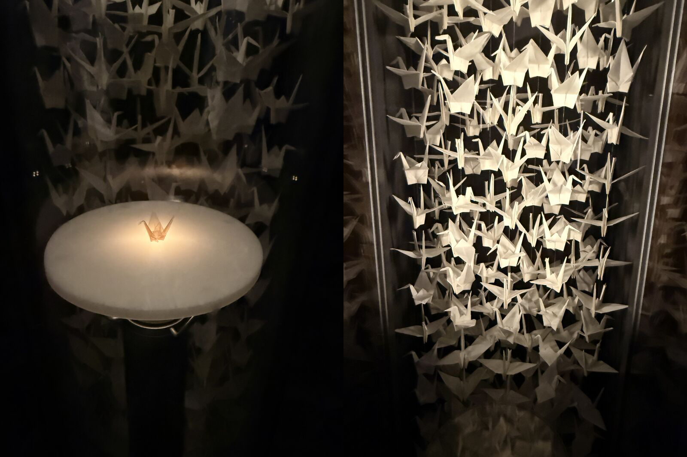

# Truman Presidential Library
## April 6, 2026

While touring the Truman Presidential Library I encountered an exhibit with origami cranes folded by a 12 year old Hiroshima survivor, Sadako Sasaki, who succumbed to leukemia 10 years later at the age of 12. She folded over 1,000 cranes because according to Japanese legend, whoever folds 1,000 origami paper cranes will be granted a wish. She wished for peace.

