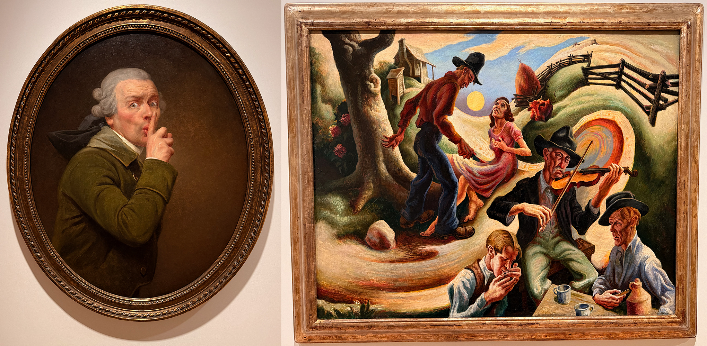

# Lawrence Day Trip
## April 9, 2026

All three of my apps involve leveraging Apple's MapKit API heavily. Two of them are little love letters to Overland Park and greater Kansas City where I have visited a ton of places, taken photos and generally just soaked in the atmosphere of where I am.

Yesterday, I did a day trip over to Lawrence, which as a Wildcat is a bit like being behind enemy lines. I had a coffee at the Espurresso Cat Cafe, lunch at the Free State Brewery, and toured the Spencer Art Museum on the KU campus.

I was unprepared to see some originals by artists I'm a bit obsessed with. You may have seen some of Joseph Ducreux's self portraits on social media. He clearly had a great sense of humor. It was a real treat to stand in front of one.

Thomas Hart Benton is one artist I've been a fan of since I saw a big retrospective of his works in the late '80s when I was in high school. This one is called "The Ballad of the Jealous Lover of Lone Green Valley."

