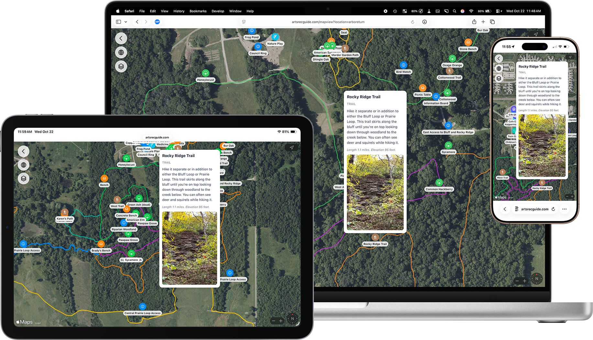

# Website Version - Arts & Rec Guide
## October 22, 2025

I had a nice public launch of the Arts and Rec Guide iOS app on Monday night during the annual Friends of the Arboretum annual membership event. While demoing the app for a few people it dawned on me that I could leverage the work already completed with the geoJSON route map files and use Apple's MapKit JS API on the web and replicate the user experience nearly identically.

Do I did.
[ARts & Rec Guide Website](http://artsrecguide.com)

