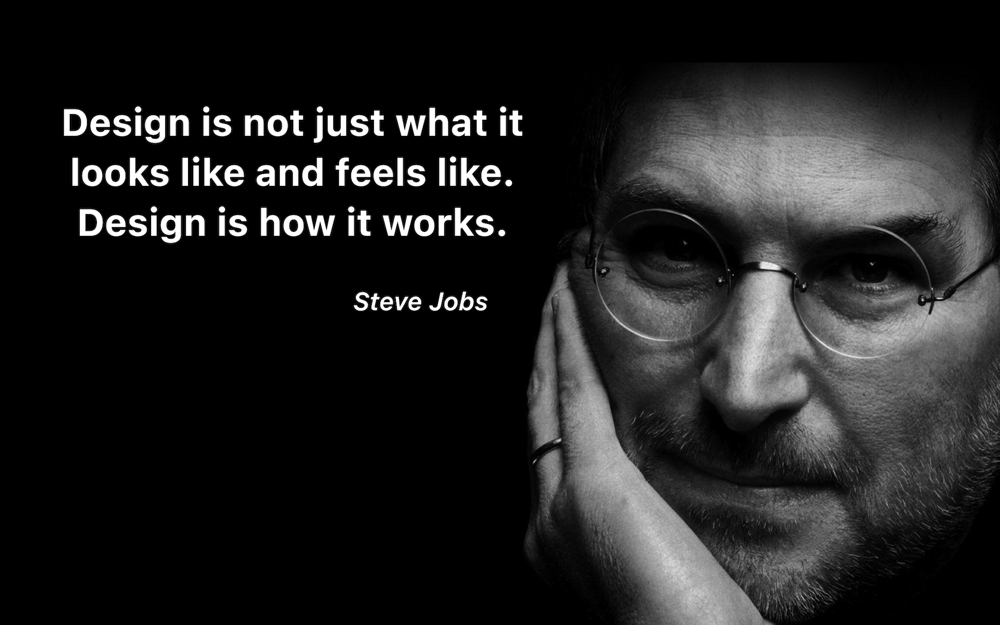

# Design Is How It Works
## September 16, 2025

I'm kind of a sponge by nature and just love absorbing knowledge about whatever is around me that sparks my curiosity. For instance, I was in the dentist's chair quite a bit recently, and I actually stopped the technician and said, “Would you describe what you’re doing and why? I'm fascinated by processes and how you do your job."

She explained in detail the high-resolution 3-D images she was taking and how they were being used in the next room to mold my crown and then bake it in the oven while I waited in the chair. The scanner had aural feedback so that she could look at me and guide the instrument without needing to look at the screen. It was musical, and the tones, really the melody, would change if she was off a little bit.

As a UX/UI designer I was fascinated by her workflow and by the choices the designer of this scanner made to use pleasant music and not an offensive, montonous tone change to keep the her on track.

It made me realize how much thoughtful design exists in places we never think to look. Good design truly isn't how things look, its how they work.

