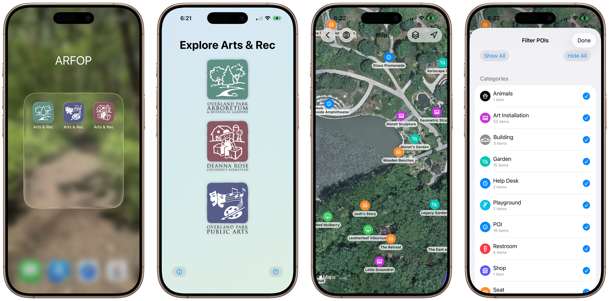

# October 5, 2025

I have been working an my first iOS app the past week called "Arts & Rec". I'm building it as an exercise to help me learn iOS development and a something I can do for the Arts and Recreation Foundation of Overland Park, of which I'm a volunteer.
It leverages the native MapKit API and JSON objects to display points of interest (POIs) across Overland Park. The POIs objects are all in one file and are categorized. The hiking trails I'm recording are GEOjson files.
The user can show and hide categories of the POIs and the trails so the map view doesn't get too cluttered. 
The user can also toggle an indicator of their current location to see where they are in relation to the POIs.

