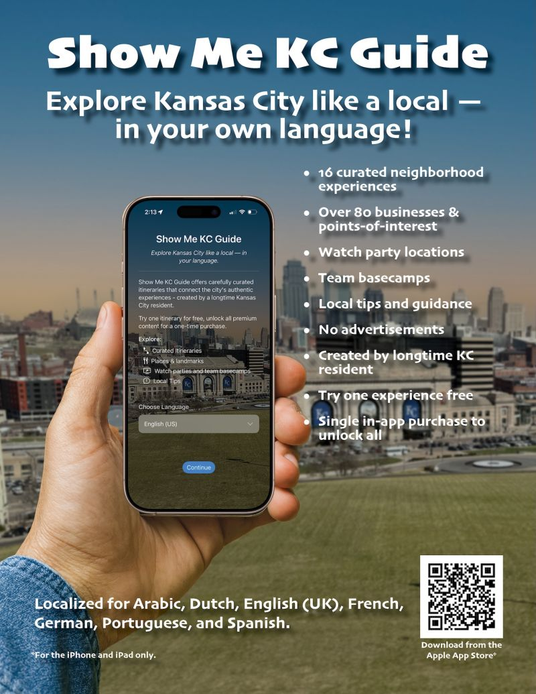

# April 9, 2026

I am approaching the end of the "curation" phase for my Show Me KC Guide iOS app. If I get my behind out of the recliner this week and next I'll have the notes and photos taken for the v1.0 (actually v2026.1) of the app.

It has been approved and live in the app store since late March, but I keep iterating on small improvements and the afore mentioned itinerary notes and photos.

I'm considering how best to promote it in a cost-effective way. I've looked at Meta platform ads and App Store ads, but wanting to explore "earned media" (free) before spending any money.

